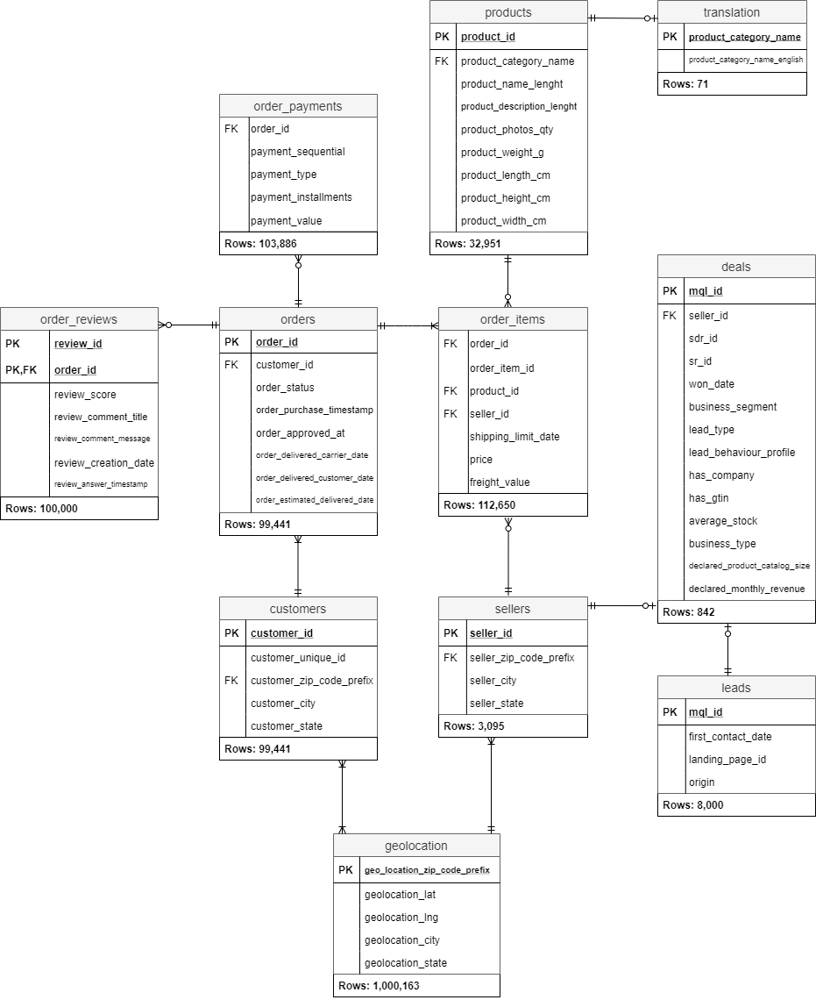

# Using MySQL to explore the Olist E-commerce data
## Introduction
This repository presents a set of Jupyter Notebooks where I practice SQL on the Olist E-commerce database. All the queries are merely to retrieve data and calculate some important KPIs, not to analyze or to address any problem for the business.  There are 7 practice notebooks, a data folder, and a photo folder. The Olist database is stored in my local desktop and connected to Jupyter Notebook.
## Data
The database has 11 datasets which contain different information of customers, sellers, orders procedure, etc. This repository, however, does not use all of these data; each practice notebook has its own topic and related datasets.
### Data source:
1. [Brazilian E-Commerce Public Dataset by Olist](https://www.kaggle.com/olistbr/brazilian-ecommerce)
2. [Marketing Funnel by Olist](https://www.kaggle.com/olistbr/marketing-funnel-olist/home)
### Relational Schema  
## Notes on data and findings
Olist is neither an E-commerce company nor a marketplace itself. Olist provides a platform for merchants to sell their products online within a marketplace. So, in this database there are three stakeholders: Olist, merchants or sellers, and the final customers or consumers. Here, merchants are Olist direct customers from where it makes profits.  Some confusing points in the data:
1. One order can have different reviews at different time even though the order has yet to be completed (delivered to the customer).
2. Customers state is actually their shipping address state (and one customer can have different ones), which is not explicit in the dataset.
3. Discrepancies between order value and payment amount.
